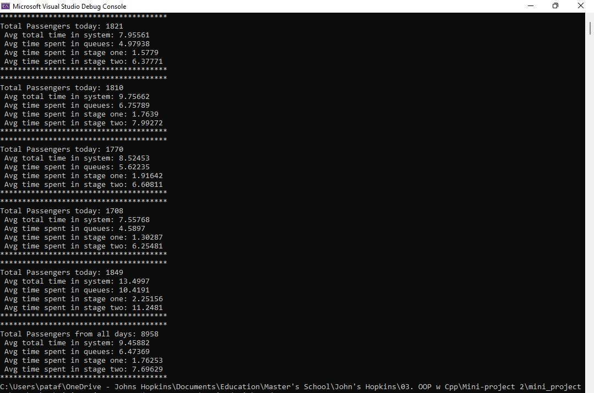
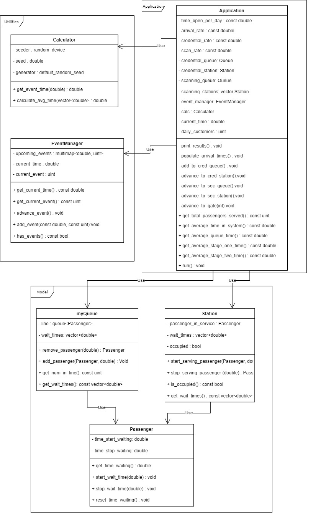

# Airport Simulation

C++ program to simulate the number of people that are able to transverse a model of airport security. This program leverages inheritance to minimize code usage.

## Screenshot

## UML Diagram

